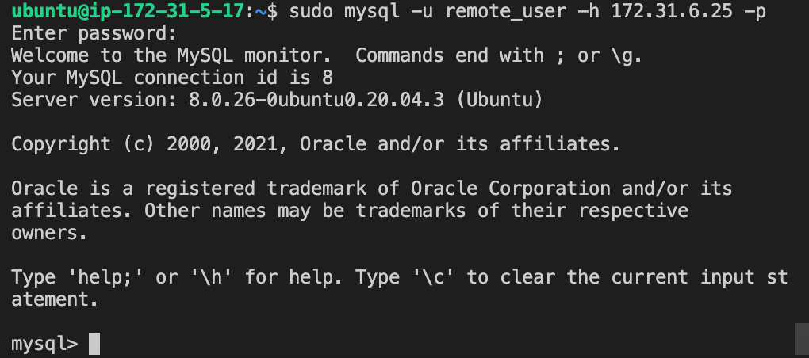

# Client Server Architecture with MySQL

*Demonstration of how to create a basic client-server architecture using MySQL Relational Database Management System. The source code used on this project was retrieved from darey.io.* 

*Instructions on how to launch and connect to your EC2 instances on:* 
https://github.com/Antonio447-cloud/MEAN-stack-angular

    Happy learning!

## Launching Ubuntu Virtual Servers

So, we will start by creating 2 Ubuntu virtual servers on AWS. One of them will be named "mysql-server" and the other one "mysql-client". 

We will launch mysql-server EC2 instance and run an update:

`sudo apt update`

After that, we will install MySQL software on mysql-server EC2 instance:

`sudo apt install mysql-server`

We enable MySQL service:

`sudo systemctl enable mysql`

Now, we connect to my 'mysql-client' EC2 instance and repeat the same process by running:

`sudo apt update`

`sudo apt install mysql-client`

*By default, both of the EC2 virtual servers are located in the same local virtual network, so they can communicate to each other using local IP addresses. So, we will use mysql-server's EC2 instance local IP address to connect from mysql-client.*

MySQL server uses TCP port 3306 by default, so we will need to open it by creating a new entry on ‘Inbound Rules’ on mysql-server's EC2 instance "Security Groups". For extra security, we will not allow all IP addresses to reach ‘mysql-server’. We will allow access only to the specific private IP address of ‘mysql-client’ EC2 instance:

We deploy MySQL server and choose validate password component for security reasons. Then we input a strong password. (Make sure you remember it)

*Not validating a password component is not good for security reasons but it is ideal for development purposes only, since we are on the development process you can also choose not to validate it.*

 Then we input 'yes' for the following:
 
 Remove anonymous users, yes. Disallow root login remotely, yes. Remove test databases and access to it, yes. Reload privileges table, yes. 

We connect to MySQL server:

`sudo mysql`

We create a remote user. 

**Note:** *('@'%') allows access from any ip address for the remote user:*

`CREATE USER 'remote_user'@'%' IDENTIFIED WITH mysql_native_password BY 'password-that-you-used';`

We create a database and grant privileges for the remote user for our database which we name 'test_db':

`CREATE DATABASE test_db;`

`GRANT ALL ON test_db.* TO 'remote_user'@'%' WITH GRANT OPTION;`

We enable the changes to take effect without reloading or restarting mysql service and exit MySQL:

`FLUSH PRIVILEGES;`

`exit;`

Now, we will configure MySQL server to allow connections from remote hosts. So we use our text editor 'vi` to go into the path: '/etc/mysql/mysql.conf.d/mysqld.cnf' and we look for 'bind-address'. Then we replace '127.0.0.1' with '0.0.0.0'.

`sudo vi /etc/mysql/mysql.conf.d/mysqld.cnf`

We restart MySQL:

`sudo systemctl restart mysql`

From `mysql-client` Ubuntu server we connect remotely to `mysql-server` using mysql-server's private ipv4.

`sudo mysql -u remote_user -h 172.31.6.25 -p`

We check that we can run commands on my MySQL database:

Congrats!! We have just created a basic client-server architechture using MySQL Relational Database Management System!